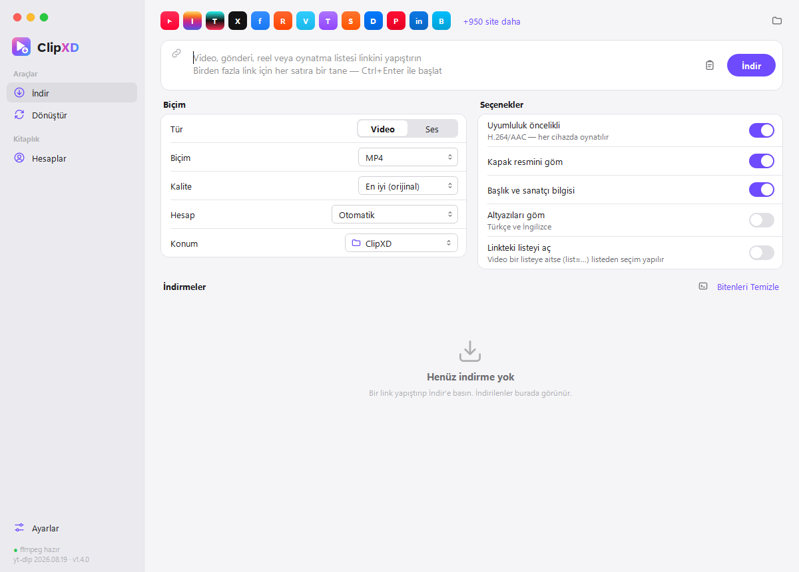
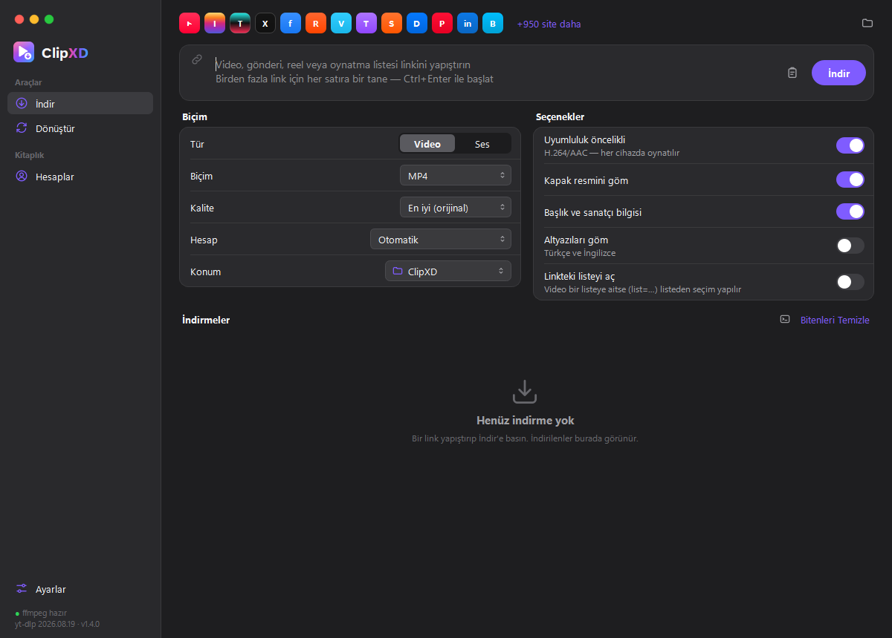

<p align="center">
  
</p>

<h1 align="center">ClipXD Desktop</h1>

<p align="center">
  Sosyal medya video indirici ve medya dönüştürücü — Windows için, macOS tarzı arayüzle.<br>
  <sub>Social media video downloader &amp; media converter for Windows (Turkish UI).</sub>
</p>

<p align="center">
  
  
</p>

## Özellikler

- **İndir:** YouTube, Instagram, TikTok, X (Twitter), Facebook, Reddit, Vimeo, Twitch, SoundCloud ve
  [yt-dlp'nin desteklediği 1000'e yakın site](https://github.com/yt-dlp/yt-dlp/blob/master/supportedsites.md).
  MP4 / MKV / WEBM video veya MP3 / M4A / OPUS / FLAC / WAV ses; 4K'ya kadar kalite seçimi, kapak resmi,
  başlık bilgileri ve altyazı gömme. Sayfanın üstündeki şerit desteklenen platformları gösterir,
  "+950 site daha" tüm sitelerin aranabilir listesini açar.
- **Oynatma listeleri:** Liste, kanal veya albüm linkinde öğeler önce taranır; onay kutulu listeden
  (arama, tümünü seç, toplam süre) istediklerinizi seçersiniz. Dosyalar liste adıyla açılan klasöre iner.
- **Hesaplar:** Hesap ekleyerek o hesabın görebildiği **gizli / takipçilere özel / abonelere özel**
  içerikleri indirebilirsiniz. Linkin sitesine uygun hesap otomatik seçilir.
- **Dönüştür:** *Uzantı değiştir* (yeniden kodlamadan, kayıpsız, saniyeler içinde) veya *yeniden kodla*
  (H.264 / H.265 / VP9, kalite, çözünürlük, kare hızı, ses kalitesi, kırpma, sesi çıkarma, GIF).
- **Temiz dosya adları:** `Video Başlığı.mp4`; aynı ad varsa üzerine yazılmaz, `Video Başlığı (1).mp4` olur.
- **Arayüz:** Trafik ışıklı çerçevesiz pencere (Windows gölgesi, yuvarlak köşeler ve Snap korunur),
  kenar çubuğu, kart düzeni, Safari İndirilenler tarzı liste, pencere içi uyarılar, Safari benzeri
  giriş penceresi. Otomatik / açık / koyu tema.

## Kurulum

Gereksinim: Windows 10/11 ve [Python 3.11+](https://www.python.org/downloads/).

```bash
git clone https://github.com/alpyxd/clipxd-desktop.git
```

1. `kurulum.bat` dosyasına çift tıklayın (sanal ortamı oluşturur ve paketleri kurar).
2. Uygulamayı `ClipXD.bat` ile başlatın.

ffmpeg ayrıca kurmanıza gerek yok; `imageio-ffmpeg` paketiyle birlikte gelir. Sisteminizde ffmpeg varsa o
kullanılır; Ayarlar'dan farklı bir konum da seçebilirsiniz.

> **YouTube notu:** yt-dlp, YouTube için bir JavaScript çalışma zamanına ihtiyaç duyar:
> [Node.js](https://nodejs.org) veya [Deno](https://deno.com) yüklü olmalıdır.

### Python gerektirmeyen sürüm (.exe)

`exe_olustur.bat` çalıştırıldığında `dist\ClipXD\ClipXD.exe` üretilir. Python kurulu olmayan bir
bilgisayara `dist\ClipXD` klasörünün tamamını kopyalamanız yeterlidir.

## Hesap ekleme

**Hesaplar → Hesap Ekle** ile platformu seçin, ardından üç yöntemden birini kullanın:

| Yöntem | Ne zaman? |
|---|---|
| **Uygulama içi giriş** (önerilen) | Safari tarzı, ayrı ve gizli bir tarayıcı penceresi açılır; hesabınıza normal şekilde girersiniz (2FA dahil). |
| **Tarayıcıdan** | Siteye tarayıcınızda zaten giriş yaptıysanız. Firefox en sorunsuzudur; Chrome/Edge yeni çerez şifrelemesi nedeniyle okunamayabilir ve kapalı olmalıdır. |
| **cookies.txt** | "Get cookies.txt LOCALLY" gibi bir eklentiyle dışa aktarılmış Netscape biçimli dosya. |

Google, uygulama içi tarayıcıda YouTube girişini engelleyebilir; bu durumda Firefox'tan içe aktarın veya
cookies.txt kullanın. Aynı platforma birden fazla hesap eklenebilir; ★ ile işaretli **varsayılan** hesap
otomatik seçilir.

## Güvenlik ve gizlilik

- **Şifreniz hiçbir zaman saklanmaz.** Uygulama içi girişte şifre yalnızca sitenin kendi sayfasına gider.
- Yalnızca seçilen platformun alan adlarına ait **oturum çerezleri** saklanır ve **Windows DPAPI** ile
  şifrelenir: dosyalar yalnızca sizin Windows hesabınızla, bu bilgisayarda çözülebilir. İndirme sırasında
  çerezler bellekte kullanılır, diske düz metin yazılmaz.
- Proxy adresi (kullanıcı adı/şifre içerebilir) de şifreli saklanır.
- Özel site alan adları doğrulanır; `com`, `co.uk` gibi çok geniş ekler reddedilir.
- Aynı anda yalnızca bir ClipXD çalışır; hesap ve ayar dosyaları birbirinin üzerine yazılmaz. Bozuk bir
  hesap listesi silinmez, yedeklenip bildirilir.
- İnternetten gelen başlıklar dosya/klasör adına güvenli şekilde çevrilir ve arayüzde HTML olarak
  yorumlanmaz.
- Veriler: `%APPDATA%\ClipXD` (Ayarlar → Veriler → *Klasörü Aç*). Eski adla (MedyaKit) kurulmuş veriler ilk
  açılışta otomatik taşınır.

## Sınırlamalar ve kullanım

- **DRM korumalı** içerikler (Netflix, Disney+, Spotify, Apple Music vb.) indirilemez.
- Hesaplar yalnızca **o hesabın zaten erişebildiği** içerikleri indirmenizi sağlar.
- Yalnızca indirme hakkınız olan içerikleri indirin. Platformların kullanım koşullarına ve telif
  haklarına uymak kullanıcının sorumluluğundadır.

## Sorun giderme

| Sorun | Çözüm |
|---|---|
| Bir sitede indirme birden bozuldu | Siteler sık değişir: **Ayarlar → yt-dlp → Güncelle**, sonra uygulamayı yeniden başlatın. |
| "İçerik giriş gerektiriyor" | Hesaplar'dan o platform için hesap ekleyin veya oturumu yenileyin. |
| "YouTube bot doğrulaması istiyor" | Bir YouTube hesabı ekleyin. |
| Chrome/Edge'den içe aktarılamıyor | Tarayıcıyı tamamen kapatın; olmazsa Firefox, uygulama içi giriş veya cookies.txt kullanın. |
| "Codec bu kapsayıcıya kopyalanamıyor" | Dönüştür'de **Yeniden kodla** modunu seçin. |
| Ayrıntılı hata görmek | İndirmeler başlığının yanındaki günlük simgesine basın. |

## Geliştirme

```bash
.venv\Scripts\python.exe -m unittest discover -s tests -v
```

```
clipxd/
  app.py              Ana pencere, tek kopya kontrolü
  downloader.py       yt-dlp indirme motoru (Qt'den bağımsız)
  converter.py        ffmpeg komutları ve ilerleme takibi
  accounts.py         Hesap deposu, çerez süzme, platform listesi
  secure_store.py     Windows DPAPI şifreleme
  sites.py            Desteklenen site listesi
  ui/theme.py         Açık/koyu renk jetonları ve stil sayfası
  ui/icons.py         Çizgi ikonlar ve ClipXD logosu
  ui/widgets.py       macOS tarzı kontroller (trafik ışıkları, anahtar, segment, kart)
  ui/frameless.py     Çerçevesiz pencere (Windows DWM)
  ui/login_dialog.py  Safari tarzı giriş penceresi
  ui/                 Diğer sayfalar ve pencereler (PySide6)
tests/                Birim, entegrasyon ve güvenlik regresyon testleri
```

Yeni bir platformu hesap listesine eklemek için `clipxd/accounts.py` içindeki `PLATFORMS` listesine giriş
sayfasını, alan adlarını ve oturum çerezi adını ekleyin.

ClipXD, indirme için [yt-dlp](https://github.com/yt-dlp/yt-dlp), dönüştürme için
[FFmpeg](https://ffmpeg.org), arayüz için [Qt for Python (PySide6)](https://doc.qt.io/qtforpython/) kullanır.
